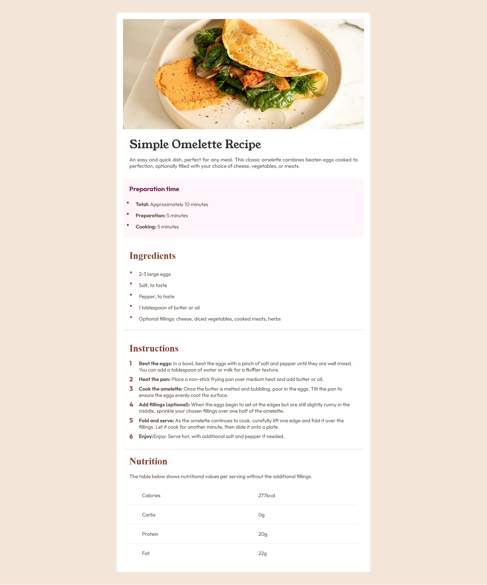

# nmelissarp.recipe-page-main.io - Recipe page solution

This is a solution to the [Recipe page challenge on Frontend Mentor](https://www.frontendmentor.io/challenges/recipe-page-KiTsR8QQKm).

## Table of contents

- [Overview](#overview)
  - [The challenge](#the-challenge)
  - [Screenshot](#screenshot)
  - [Links](#links)
- [My process](#my-process)
  - [Built with](#built-with)

## Overview

### The Challenge
This is a static page that was built using only html and css styles, I tried to make it mobile-first, a responsive page. The theme of the page is an Omelette recipe.

### Screenshot

### Links

- Solution URL: [Recipe page main](https://nmelissarp.github.io/recipe-page-main/)

## My process

### Built with

- Semantic HTML5 markup
- CSS custom properties
- Mobile-first workflow
